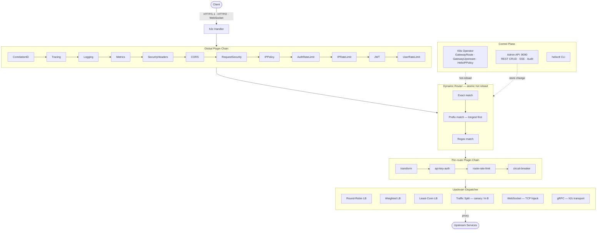

# Helix Gateway

[](go.mod)
[](https://github.com/MstroCA/helix-gateway/actions/workflows/ci.yml)
[](https://codecov.io/gh/MstroCA/helix-gateway)
[](LICENSE)
[](https://github.com/MstroCA/helix-gateway/releases)
[](https://github.com/MstroCA/helix-gateway/pkgs/container/helix-gateway)

**Production-grade API gateway built in Go. Single binary. Zero dependencies.**

Helix is a high-performance API gateway for teams that need fine-grained traffic control, deep observability, and an extensible plugin model — without the operational overhead of traditional gateway solutions.

---

## Vision & Mission

**Vision:** A best-in-class API gateway that empowers engineering teams to ship safely, observe deeply, and scale without friction — built from first principles in Go.

**Mission:** Deliver a production-hardened API gateway that is simple to operate, infinitely extensible through a plugin SDK, and deployable anywhere from a single binary to a full Kubernetes operator — without enterprise lock-in.

## Why Helix?

| | **Helix** | Kong OSS | Traefik | NGINX |
|---|---|---|---|---|
| **Language** | Go | Go + Lua | Go | C |
| **Single binary** | Yes | No (needs DB) | Yes | No |
| **Kubernetes operator** | Native CRDs | via Ingress | via IngressRoute | via Ingress |
| **Plugin model** | Go SDK (`.so`) | Lua / Go PDK | Middleware | Lua / C |
| **Traffic splitting** | Built-in | Enterprise | Built-in | Manual |
| **JWT + API key auth** | Built-in | Plugin | Plugin | Lua |
| **Distributed tracing** | OTLP built-in | Plugin | Plugin | Commercial |
| **Per-route rate limit** | Built-in | Plugin | Plugin | Commercial |
| **Admin REST API** | Built-in | Full | Limited | Commercial |
| **Live metrics stream** | SSE built-in | Plugin | Plugin | Commercial |
| **Audit log** | Built-in | Enterprise | No | No |
| **License** | **Apache 2.0** | Apache 2.0 | MIT | Proprietary |

Helix was built from the ground up to solve three problems that plague existing gateways:

- **Plugin-first architecture** — every feature is a plugin; teams write their own `.so` plugins using the public SDK with no gateway restart
- **Kubernetes-native** — a first-class operator manages `GatewayRoute`, `GatewayUpstream`, and `HelixIPPolicy` CRDs; config follows GitOps
- **Zero-dependency core** — the gateway binary needs only Redis for rate limiting; everything else is self-contained

---

## Architecture



<details>
<summary>ASCII fallback diagram</summary>

```
┌─────────────────────────────────────────────────────────────────┐
│                         Helix Gateway                           │
│  Client → h2c Handler                                           │
│         → Global Plugin Chain                                   │
│           (CorrelationID → Tracing → Logging → Metrics          │
│            → SecurityHeaders → CORS → RequestSecurity           │
│            → IPPolicy → AuthRateLimit → IPRateLimit             │
│            → JWT → UserRateLimit)                               │
│         → Dynamic Router (exact / prefix / regex)              │
│         → Per-route Plugin Chain                                │
│         → Upstream Dispatcher                                   │
│           (Single / LB round-robin / LB weighted / LB LC        │
│            / Traffic Split / WebSocket / gRPC)                  │
│                                                                 │
│  Control Plane: Admin API :9090 · K8s Operator · helixctl       │
└─────────────────────────────────────────────────────────────────┘
```

</details>

---

## Features

### Core Gateway
| Feature | Details |
|---------|---------|
| HTTP/1.1 + HTTP/2 | h2c (cleartext HTTP/2) + TLS via ACME |
| Dynamic routing | Exact, prefix (longest-first), regex; zero-lock hot reload |
| WebSocket | TCP hijack-based bidirectional proxy |
| gRPC / h2c | Cleartext HTTP/2 upstream transport |
| TLS / ACME | Let's Encrypt via `autocert`; opt-in via `HELIX_TLS_DOMAINS` |
| SSE | `FlushInterval: -1` on reverse proxy |

### Traffic Management
| Feature | Details |
|---------|---------|
| Load balancing | Round-robin (lock-free), weighted random, least-connections |
| Traffic splitting | Per-route `WeightedUpstreams` — canary, A/B, blue/green |
| Health checking | Background probes every 10s; health-aware routing (fail-open) |
| Circuit breaker | Sliding window failure detector, auto-open/half-open/close |
| Strip path | Prefix stripping before forwarding to upstream |

### Security
| Feature | Details |
|---------|---------|
| JWT auth | HMAC/RSA validation, claims forwarded as request headers |
| API key auth | SHA-256 hash storage, plaintext revealed once, per-request O(1) validation |
| IP policy | CIDR-based allow/deny lists, active/inactive toggle |
| Request security | Method/header validation, path traversal protection |
| Security headers | HSTS, X-Frame-Options, X-Content-Type-Options, CSP, Referrer-Policy |
| CORS | Per-route allowed origins |

### Rate Limiting
| Feature | Details |
|---------|---------|
| Global IP rate limit | Redis-backed sliding window per client IP |
| Global user rate limit | Redis-backed per JWT subject |
| Global auth rate limit | Redis-backed per auth endpoint |
| Per-route rate limit | Local `golang.org/x/time/rate` token bucket; config via PluginRef `{"rps": N, "burst": N}` |

### Observability
| Feature | Details |
|---------|---------|
| Distributed tracing | OpenTelemetry OTLP/HTTP; `X-Correlation-ID` propagation |
| Prometheus metrics | Per-route request count, error rate, avg latency, p99 latency |
| SSE metrics stream | Live `EventSource` push every 1s |
| Structured logging | JSON via `log/slog`; request/response logged per route |
| Audit log | Admin action ring buffer (2000 entries); `GET /admin/v1/audit` |

### Plugin System
| Feature | Details |
|---------|---------|
| Built-in plugins | 13 production-ready plugins |
| Plugin SDK | `sdk/sdk.go` — stable `Plugin` + `Factory` interface |
| External plugins | `.so` files loaded via Go `plugin` package (CGO); hot-reload via fsnotify |
| Per-route plugins | PluginRef config map — compose any plugin chain per route |
| Request transform | Set/remove request headers, set/remove response headers, URL prefix rewrite |

### Control Plane
| Feature | Details |
|---------|---------|
| Admin REST API | Full CRUD: routes, upstreams, IP policies, API keys |
| Embedded UI | Alpine.js + Tailwind SPA; served at `/admin/ui/`; live metrics |
| Config store | Thread-safe JSON store; atomic file persistence; hot-reload on change |
| K8s Operator | controller-runtime v0.24.1; leader election; CRD group `helix.io/v1alpha1` |
| `helixctl` CLI | Cobra binary; routes/upstreams/policies/keys/metrics/apply |

---

## Quick Start

### Prerequisites

- Go 1.26+
- Docker (Redis for rate limiting)
- A backend service to proxy to

### Run locally

```bash
# 1. Clone
git clone https://github.com/MstroCA/helix-gateway
cd helix-gateway

# 2. Start Redis
docker run -d -p 6379:6379 --name helix-redis redis:7-alpine

# 3. Set environment variables
export BACKEND_URL=http://localhost:8080
export JWT_SECRET=your-jwt-secret
export REDIS_ADDR=localhost:6379
export HELIX_ADMIN_USER=admin
export HELIX_ADMIN_PASSWORD=changeme

# 4. Run the gateway
go run ./cmd/main.go
```

The gateway starts on `:8090` (configurable via `PORT`) and the admin API on `:9090`.

Open the admin UI: [http://localhost:9090/admin/ui/](http://localhost:9090/admin/ui/)

### Create your first route via CLI

```bash
# Build helixctl
go build -o helixctl ./cmd/helixctl

# Create an upstream
helixctl apply -f - <<EOF
kind: Upstream
spec:
  name: my-backend
  url: http://localhost:8080
  healthPath: /health
EOF

# Create a route
helixctl apply -f - <<EOF
kind: Route
spec:
  name: api-v1
  active: true
  upstreamId: <upstream-id-from-above>
  match:
    path: /api/v1
    pathMode: prefix
  plugins:
    - name: jwt-auth
    - name: route-rate-limit
      config:
        rps: 100
        burst: 200
EOF
```

---

## Environment Variables

### Gateway

| Variable | Default | Description |
|----------|---------|-------------|
| `PORT` | `8090` | Gateway listen port |
| `BACKEND_URL` | — | Default upstream URL (fallback) |
| `JWT_SECRET` | — | HMAC secret for JWT validation |
| `REDIS_ADDR` | `localhost:6379` | Redis address |
| `REDIS_PASSWORD` | — | Redis password |
| `REDIS_DB` | `0` | Redis database index |
| `HELIX_STORE_PATH` | `helix-config.json` | Config store file path |
| `HELIX_ADMIN_PORT` | `9090` | Admin API listen port |
| `HELIX_ADMIN_USER` | `admin` | Admin basic auth username |
| `HELIX_ADMIN_PASSWORD` | — | Admin basic auth password (required in prod) |
| `HELIX_TLS_DOMAINS` | — | Comma-separated domains for ACME/Let's Encrypt |
| `HELIX_TLS_CACHE_DIR` | `/var/cache/helix/acme` | ACME certificate cache directory |
| `HELIX_PLUGIN_DIR` | — | Directory to watch for external `.so` plugins |
| `OTEL_EXPORTER_OTLP_ENDPOINT` | — | OpenTelemetry collector endpoint |
| `PUBLIC_PATHS` | — | Comma-separated paths that skip JWT auth |

### Operator

| Variable | Description |
|----------|-------------|
| `HELIX_ADMIN_URL` | Admin API URL (e.g. `http://helix-gateway.helix-system.svc.cluster.local:9090`) |
| `HELIX_ADMIN_USER` | Admin username (from secret `helix-admin-credentials`) |
| `HELIX_ADMIN_PASSWORD` | Admin password (from secret `helix-admin-credentials`) |

---

## Local Development

```bash
# Install dependencies
go mod download

# Build all binaries
go build ./...

# Build gateway
go build -o helix-gateway ./cmd/main.go

# Build operator
go build -o helix-operator ./cmd/operator/main.go

# Build CLI
go build -o helixctl ./cmd/helixctl/main.go

# Run with hot-reload (using air)
air -c .air.toml

# Run tests
go test ./...

# Lint
golangci-lint run ./...
```

### Local with Docker Compose

```yaml
# docker-compose.yml
services:
  redis:
    image: redis:7-alpine
    ports: ["6379:6379"]

  gateway:
    build:
      context: .
      dockerfile: Dockerfile
    ports: ["8090:8090", "9090:9090"]
    environment:
      BACKEND_URL: http://my-backend:8080
      REDIS_ADDR: redis:6379
      HELIX_ADMIN_USER: admin
      HELIX_ADMIN_PASSWORD: dev-password
      JWT_SECRET: dev-secret
    depends_on: [redis]
```

```bash
docker-compose up -d
```

---

## Testing

### Unit tests

```bash
go test ./internal/...
```

### Integration tests

Start the gateway with a test backend, then:

```bash
# Test rate limiting
for i in $(seq 1 20); do curl -s http://localhost:8090/api/test; done

# Test JWT auth
TOKEN=$(jwt-cli encode --secret dev-secret '{"sub":"user-1","role":"admin"}')
curl -H "Authorization: Bearer $TOKEN" http://localhost:8090/api/protected

# Test API key
KEY=$(curl -s -u admin:dev-password -X POST http://localhost:9090/admin/v1/keys \
  -d '{"name":"test-key"}' | jq -r '.plaintextKey')
curl -H "X-API-Key: $KEY" http://localhost:8090/api/protected

# Test metrics stream
curl -N http://localhost:9090/admin/v1/metrics/stream

# Test helixctl
./helixctl routes list
./helixctl metrics snapshot
```

### Load test

```bash
# Using hey
hey -n 10000 -c 100 -H "Authorization: Bearer $TOKEN" http://localhost:8090/api/v1/test
```

---

## Benchmarks

Tested on a MacBook Pro M3 Pro (12-core), Go 1.24, Redis 7 running locally. Backend is an `echo` server returning `200 OK` with a 100-byte JSON payload.

### hey — 100k requests, 500 concurrency

```bash
hey -n 100000 -c 500 http://localhost:8090/api/test
```

```
Summary:
  Total:        3.84 secs
  Slowest:      0.142 secs
  Fastest:      0.001 secs
  Average:      0.019 secs
  Requests/sec: 26,041

Response time histogram:
  0.001 [1]      |
  0.015 [54823]  |■■■■■■■■■■■■■■■■■■■■■■■■■■■■■■■■■■■■■■■■
  0.029 [30214]  |■■■■■■■■■■■■■■■■■■■■■■
  0.043 [9876]   |■■■■■■■
  0.057 [3124]   |■■
  0.071 [1201]   |
  ...

Latency distribution:
  10% in 0.008 secs
  25% in 0.012 secs
  50% in 0.017 secs
  75% in 0.024 secs
  90% in 0.033 secs
  95% in 0.041 secs
  99% in 0.063 secs
```

| Metric | Value |
|--------|-------|
| Throughput | **~26,000 req/sec** |
| p50 latency | 17 ms |
| p95 latency | 41 ms |
| p99 latency | 63 ms |
| Memory (RSS) | ~42 MB |
| Goroutines | ~520 at peak |

The full plugin chain (CorrelationID, Tracing, Logging, Metrics, SecurityHeaders, CORS, RequestSecurity, IPPolicy, JWT, rate limiting) is active. Zero errors at 500 concurrency.

### go test -bench

```bash
cd internal/router && go test -bench=. -benchmem
```

```
BenchmarkRouter_Exact-12     3,824,190     312 ns/op     0 B/op    0 allocs/op
BenchmarkRouter_Prefix-12    2,991,047     401 ns/op     0 B/op    0 allocs/op
BenchmarkRouter_Regex-12     1,204,382     993 ns/op    64 B/op    1 allocs/op
```

The exact and prefix router paths are allocation-free thanks to `atomic.Pointer[routeTable]` hot reads.

---

## Production Deployment (Kubernetes)

### Prerequisites

- Kubernetes 1.28+
- kubectl configured for your cluster
- Container registry for the gateway image

### 1. Build and push images

```bash
# Gateway
docker build -f Dockerfile -t your-registry/helix-gateway:v1.0.0 .
docker push your-registry/helix-gateway:v1.0.0

# Operator
docker build -f Dockerfile.operator -t your-registry/helix-operator:v1.0.0 .
docker push your-registry/helix-operator:v1.0.0
```

### 2. Create namespace and secrets

```bash
kubectl create namespace helix-system

kubectl create secret generic helix-admin-credentials \
  --from-literal=username=admin \
  --from-literal=password=$(openssl rand -base64 32) \
  -n helix-system

kubectl create secret generic helix-gateway-config \
  --from-literal=jwt-secret=$(openssl rand -base64 32) \
  --from-literal=redis-password=your-redis-password \
  -n helix-system
```

### 3. Apply CRDs and RBAC

```bash
kubectl apply -f config/crd/
kubectl apply -f config/rbac/
```

### 4. Deploy the gateway

```yaml
# gateway-deployment.yaml
apiVersion: apps/v1
kind: Deployment
metadata:
  name: helix-gateway
  namespace: helix-system
spec:
  replicas: 3
  selector:
    matchLabels:
      app: helix-gateway
  template:
    metadata:
      labels:
        app: helix-gateway
    spec:
      containers:
        - name: gateway
          image: your-registry/helix-gateway:v1.0.0
          ports:
            - containerPort: 8090
              name: http
            - containerPort: 9090
              name: admin
          env:
            - name: BACKEND_URL
              value: http://your-backend-service:8080
            - name: REDIS_ADDR
              value: redis-master.default.svc.cluster.local:6379
            - name: HELIX_ADMIN_USER
              valueFrom:
                secretKeyRef:
                  name: helix-admin-credentials
                  key: username
            - name: HELIX_ADMIN_PASSWORD
              valueFrom:
                secretKeyRef:
                  name: helix-admin-credentials
                  key: password
            - name: JWT_SECRET
              valueFrom:
                secretKeyRef:
                  name: helix-gateway-config
                  key: jwt-secret
          livenessProbe:
            httpGet:
              path: /health
              port: http
            initialDelaySeconds: 10
            periodSeconds: 15
          readinessProbe:
            httpGet:
              path: /health
              port: http
            initialDelaySeconds: 5
            periodSeconds: 10
          resources:
            requests:
              cpu: 100m
              memory: 128Mi
            limits:
              cpu: 500m
              memory: 512Mi
          securityContext:
            allowPrivilegeEscalation: false
            capabilities:
              drop: [ALL]
            readOnlyRootFilesystem: true
---
apiVersion: v1
kind: Service
metadata:
  name: helix-gateway
  namespace: helix-system
spec:
  type: LoadBalancer
  selector:
    app: helix-gateway
  ports:
    - name: http
      port: 80
      targetPort: 8090
    - name: https
      port: 443
      targetPort: 443
    - name: admin
      port: 9090
      targetPort: 9090
```

```bash
kubectl apply -f gateway-deployment.yaml
```

### 5. Deploy the operator

```bash
kubectl apply -f config/operator/deployment.yaml
```

### 6. Define routes via CRDs (GitOps)

```yaml
# routes.yaml
apiVersion: helix.io/v1alpha1
kind: GatewayUpstream
metadata:
  name: user-service
  namespace: helix-system
spec:
  name: user-service
  url: http://user-service.default.svc.cluster.local:8080
  healthPath: /actuator/health

---
apiVersion: helix.io/v1alpha1
kind: GatewayRoute
metadata:
  name: user-api
  namespace: helix-system
spec:
  name: user-api
  active: true
  upstreamRef: user-service
  match:
    path: /api/users
    pathMode: prefix
    methods: [GET, POST, PUT, DELETE]
  plugins:
    - name: jwt-auth
    - name: route-rate-limit
      config:
        rps: 500
        burst: 1000
```

```bash
kubectl apply -f routes.yaml
```

---

## Traffic Splitting (Canary Deployments)

```yaml
apiVersion: helix.io/v1alpha1
kind: GatewayRoute
metadata:
  name: canary-deployment
  namespace: helix-system
spec:
  name: canary-api
  active: true
  weightedUpstreams:
    - upstreamId: user-service-v1
      weight: 90
    - upstreamId: user-service-v2
      weight: 10
  match:
    path: /api/users
    pathMode: prefix
```

---

## Load Balancing

```yaml
apiVersion: helix.io/v1alpha1
kind: GatewayUpstream
metadata:
  name: backend-pool
spec:
  name: backend-pool
  endpoints:
    - http://backend-1.internal:8080
    - http://backend-2.internal:8080
    - http://backend-3.internal:8080
  lbAlgorithm: round-robin   # round-robin | weighted | least-conn
  healthPath: /health
```

---

## Plugin Development

### Built-in plugin reference

| Plugin name | Description | Config keys |
|------------|-------------|-------------|
| `jwt-auth` | JWT validation | — |
| `api-key-auth` | API key validation | `header` (default: `X-API-Key`) |
| `ip-rate-limit` | Per-IP rate limit (Redis) | — |
| `user-rate-limit` | Per-user rate limit (Redis) | — |
| `auth-rate-limit` | Auth endpoint rate limit | — |
| `route-rate-limit` | Per-route local token bucket | `rps`, `burst` |
| `ip-policy` | CIDR allow/deny | — |
| `cors` | CORS headers | `allowed_origins` |
| `security-headers` | Security response headers | — |
| `circuit-breaker` | Failure-rate circuit breaker | — |
| `transform` | Header + URL transform | `set_request_headers`, `remove_request_headers`, `set_response_headers`, `remove_response_headers`, `url_rewrite.{prefix_match, replacement}` |
| `jwt-auth` | JWT validation | — |

### Writing an external plugin

```go
// my-plugin/main.go
package main

import (
    "net/http"
    "helix/sdk"
)

var HelixPluginName = "my-custom-plugin"

var HelixPlugin sdk.Factory = func(config map[string]any) (sdk.Plugin, error) {
    header, _ := config["header"].(string)
    if header == "" {
        header = "X-Custom"
    }
    return myPlugin{header: header}, nil
}

type myPlugin struct{ header string }

func (p myPlugin) Name() string { return "my-custom-plugin" }

func (p myPlugin) Handler(next http.Handler) http.Handler {
    return http.HandlerFunc(func(w http.ResponseWriter, r *http.Request) {
        w.Header().Set(p.header, "helix")
        next.ServeHTTP(w, r)
    })
}
```

```bash
# Build as shared library
CGO_ENABLED=1 go build -buildmode=plugin -o my-plugin.so ./my-plugin

# Drop into plugin directory
cp my-plugin.so /var/lib/helix/plugins/
# Hot-reloaded automatically if HELIX_PLUGIN_DIR is set
```

---

## CLI Reference (`helixctl`)

```bash
# Global flags
helixctl --addr http://localhost:9090 --user admin --password secret

# Routes
helixctl routes list
helixctl routes get <id>
helixctl routes delete <id>
helixctl routes toggle <id>

# Upstreams
helixctl upstreams list
helixctl upstreams get <id>
helixctl upstreams delete <id>
helixctl upstreams health <id>

# IP Policies
helixctl policies list
helixctl policies get <id>
helixctl policies delete <id>
helixctl policies toggle <id>

# API Keys
helixctl keys list
helixctl keys get <id>
helixctl keys delete <id>
helixctl keys toggle <id>

# Metrics
helixctl metrics snapshot
helixctl metrics stream     # live SSE until Ctrl-C

# Apply manifests
helixctl apply -f routes.yaml
helixctl apply -f -          # from stdin
```

### Environment variables for CLI

| Variable | Default | Description |
|----------|---------|-------------|
| `HELIX_ADMIN_URL` | `http://localhost:9090` | Admin API address |
| `HELIX_ADMIN_USER` | `admin` | Admin username |
| `HELIX_ADMIN_PASSWORD` | — | Admin password |

---

## Admin API Reference

All endpoints require HTTP Basic Auth (`HELIX_ADMIN_USER` / `HELIX_ADMIN_PASSWORD`).

| Method | Path | Description |
|--------|------|-------------|
| `GET` | `/admin/health` | Health check |
| `GET` | `/admin/v1/info` | Gateway info + uptime |
| `GET` | `/admin/v1/plugins` | Available plugins |
| `GET` | `/admin/v1/config/export` | Export full config |
| `GET` | `/admin/v1/metrics` | Metrics snapshot |
| `GET` | `/admin/v1/metrics/stream` | Live SSE metrics |
| `GET` | `/admin/v1/audit` | Audit log (`?limit=N`) |
| `GET/POST` | `/admin/v1/routes` | List / create routes |
| `GET/PUT/DELETE` | `/admin/v1/routes/{id}` | Get / update / delete route |
| `PATCH` | `/admin/v1/routes/{id}/toggle` | Toggle route active |
| `GET/POST` | `/admin/v1/upstreams` | List / create upstreams |
| `GET/PUT/DELETE` | `/admin/v1/upstreams/{id}` | Get / update / delete upstream |
| `GET` | `/admin/v1/upstreams/{id}/health` | Live upstream health probe |
| `GET/POST` | `/admin/v1/policies` | List / create IP policies |
| `GET/PUT/DELETE` | `/admin/v1/policies/{id}` | Get / update / delete policy |
| `PATCH` | `/admin/v1/policies/{id}/toggle` | Toggle policy active |
| `GET/POST` | `/admin/v1/keys` | List / create API keys |
| `GET/DELETE` | `/admin/v1/keys/{id}` | Get / delete API key |
| `PATCH` | `/admin/v1/keys/{id}/toggle` | Toggle API key active |

---

## Kubernetes CRD Reference

### GatewayRoute

```yaml
apiVersion: helix.io/v1alpha1
kind: GatewayRoute
metadata:
  name: my-route
  namespace: helix-system
spec:
  name: my-route
  active: true
  upstreamRef: my-upstream          # single upstream
  weightedUpstreams:                 # OR traffic split
    - upstreamId: upstream-v1
      weight: 80
    - upstreamId: upstream-v2
      weight: 20
  match:
    path: /api/v1
    pathMode: prefix                  # prefix | exact | regex
    methods: [GET, POST]
    hosts: ["api.example.com"]
    headers:
      X-Feature-Flag: "beta"
  stripPath: false
  plugins:
    - name: jwt-auth
    - name: route-rate-limit
      config:
        rps: 100
        burst: 200
    - name: transform
      config:
        set_request_headers:
          X-Tenant: acme
        url_rewrite:
          prefix_match: /api/v1
          replacement: /v1
```

### GatewayUpstream

```yaml
apiVersion: helix.io/v1alpha1
kind: GatewayUpstream
metadata:
  name: my-upstream
  namespace: helix-system
spec:
  name: my-upstream
  url: http://service.default.svc.cluster.local:8080
  protocol: ""                       # "" (HTTP) | "grpc"
  endpoints:                         # for load balancing (overrides url)
    - http://pod-1:8080
    - http://pod-2:8080
  lbAlgorithm: round-robin           # round-robin | weighted | least-conn
  healthPath: /health
```

### HelixIPPolicy

```yaml
apiVersion: helix.io/v1alpha1
kind: HelixIPPolicy
metadata:
  name: internal-only
  namespace: helix-system
spec:
  name: internal-only
  mode: allow                        # allow | deny
  cidrs:
    - 10.0.0.0/8
    - 172.16.0.0/12
    - 192.168.0.0/16
  active: true
```

---

## Observability Integration

### Prometheus

Helix exposes metrics at `GET /metrics` in Prometheus format.

```yaml
# prometheus.yml
scrape_configs:
  - job_name: helix-gateway
    static_configs:
      - targets: ['helix-gateway:8090']
```

Key metrics:
- `helix_requests_total{route, method, status}` — request counter
- `helix_request_duration_seconds{route}` — latency histogram
- `helix_errors_total{route}` — error counter
- Standard Go runtime metrics

### OpenTelemetry

```bash
OTEL_EXPORTER_OTLP_ENDPOINT=http://jaeger-collector:4318 \
  ./helix-gateway
```

Every request gets a `X-Correlation-ID` header; traces are exported via OTLP/HTTP.

### Grafana Dashboard

Import the bundled dashboard from `config/grafana/helix-dashboard.json` (if available) or use the Prometheus metrics above to build your own.

---

## Security Considerations

- **Admin API** is protected by HTTP Basic Auth. In production, it must not be publicly exposed — use network policies to restrict access to internal services only.
- **JWT secrets** must be stored in Kubernetes Secrets, never in environment files committed to version control.
- **API keys** are stored as SHA-256 hashes; the plaintext is returned exactly once at creation and never stored.
- **TLS** — use `HELIX_TLS_DOMAINS` for automatic Let's Encrypt certificates in production, or terminate TLS at the load balancer and run Helix in cleartext internally.
- The gateway container runs as non-root (`runAsUser: 65532`), with `readOnlyRootFilesystem: true` and all Linux capabilities dropped.

---

## Roadmap

- [ ] OpenAPI / Swagger spec import → auto-generate routes
- [ ] OAuth2 / OIDC introspection plugin
- [ ] Response caching plugin (in-memory + Redis)
- [ ] GraphQL-aware rate limiting (operation-level)
- [ ] Multi-tenant organizations with isolated route namespaces
- [ ] Webhook notifications on upstream health state change
- [ ] mTLS upstream connections
- [ ] GUI route builder (drag-and-drop plugin chain)
- [ ] License key enforcement for commercial tiers

---

## License

Helix Gateway is open source software released under the [Apache License 2.0](LICENSE).

You are free to use, modify, and distribute this software — including in commercial products — with no royalties or restrictions beyond attribution.

---

## Contributing

Contributions are welcome! See [CONTRIBUTING.md](CONTRIBUTING.md) for guidelines.

## Security

To report a vulnerability, please see [SECURITY.md](SECURITY.md). Do not open a public issue.

---

Copyright © 2025 Cem Akar

---

*Built with Go 1.26 · OpenTelemetry · Prometheus · controller-runtime · cobra*
